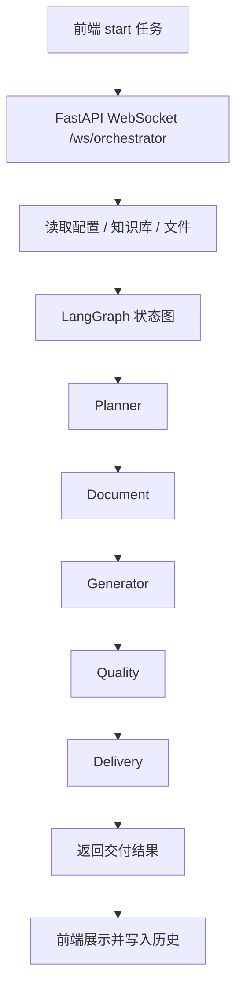

# MADO 后端与业务逻辑说明文档

## 1. 后端到底做了什么

后端是整个项目的业务核心，负责：

1. 接收前端任务请求。
2. 维护任务、知识库和配置数据。
3. 用 LangGraph 串起五个 Agent。
4. 做 RAG 检索和上下文拼装。
5. 调用大模型并流式返回过程事件。
6. 处理工具调用审批和中断。

前端只是操作台，真正的流程控制、模型调用和数据落库都在后端。

## 2. 后端技术栈

| 分类 | 技术 |
| --- | --- |
| Web 框架 | FastAPI |
| 运行服务 | Uvicorn |
| 数据校验 | Pydantic v2 + pydantic-settings |
| ORM | SQLAlchemy 2 |
| 数据库 | SQLite |
| 编排 | LangGraph |
| AI 接入 | LangChain + langchain-openai + langchain-anthropic |
| 检索 | BM25 |
| 实时通信 | WebSocket |

## 3. 后端目录里的业务模块

| 模块 | 作用 |
| --- | --- |
| `app/api/routes` | REST 接口和 WebSocket 入口 |
| `app/agents` | 多 Agent 状态机、Prompt、执行逻辑 |
| `app/rag` | 文档加载、切片后的检索、上下文窗口构建 |
| `app/db` | SQLAlchemy 模型、Session、初始化和迁移 |
| `app/services/providers.py` | 统一封装 OpenAI / Anthropic / Groq / SiliconFlow |
| `app/tools` | 内置工具和工具参数校验 |
| `app/plugins` | Agent 插件机制 |

## 4. 数据模型

数据库里主要有 5 张表：

| 表 | 用途 |
| --- | --- |
| `tasks` | 任务历史 |
| `chat_messages` | 任务中的消息记录 |
| `rag_documents` | RAG 文档主表 |
| `document_chunks` | 文档切片表 |
| `app_configs` | 应用配置和 API Key |

启动时会自动建表，并且兼容旧的 camelCase 字段迁移。

## 5. 业务主流程

### 5.1 启动任务

前端通过 WebSocket 发送 `start` 消息，后端会：

1. 解析需求、技术栈、上传文件、Agent 开关和 Pipeline。
2. 从数据库加载知识库文档。
3. 根据配置确定每个 Agent 的超时和重试次数。
4. 组装 LangGraph 的初始状态。

### 5.2 五个 Agent 的职责

| Agent | 职责 |
| --- | --- |
| `planner` | 把自然语言需求拆成任务 |
| `document` | 解析上传文档和项目规范 |
| `generator` | 生成代码 |
| `quality` | 检查质量、问题和规范 |
| `delivery` | 整理最终交付物 |

这不是“一个模型连续输出五段话”，而是有明确状态流转的编排式执行。

### 5.3 模型选择逻辑

后端根据配置决定用哪个模型：

1. `modelMode=dual` 时，默认 OpenAI + Anthropic 协同。
2. `gpt-only` 时只走 OpenAI。
3. `claude-only` 时只走 Anthropic。
4. Groq 和 SiliconFlow 走 OpenAI 兼容接口。

`providers.py` 负责把这些差异统一封装起来。

### 5.4 工具调用和审批

Agent 可能会发起工具调用，后端支持：

1. 内置工具定义。
2. 工具参数校验。
3. 工具执行结果回传。
4. 高风险工具需要前端审批。
5. 前端可以发 `tool_approval` 消息继续或拒绝。

这套机制让模型不是“想干啥就干啥”，而是带有人工确认的半自动流程。

### 5.5 中断和恢复

用户可以中断任务。后端会：

1. 取消当前任务的后台执行。
2. 停止继续推送事件。
3. 让前端把任务标记为中断或失败。

## 6. RAG 业务逻辑

RAG 不是只做一次简单搜索，而是分三层：

1. 文档入库。
2. 文档切片。
3. 检索 + 重排 + 上下文拼装。

### 6.1 文档入库

前端上传文档后，后端会保存：

1. 原始文档内容。
2. 切片列表。
3. 对应的 chunk 记录。

### 6.2 检索逻辑

`app/rag/middleware.py` 做的是增强版检索：

1. Query 词展开。
2. BM25 打分。
3. 基于 Agent 的关键词偏置。
4. 生成上下文窗口。

### 6.3 RAG 问答

`/api/rag/ask` 的流程是：

1. 找相关切片。
2. 拼接来源文本。
3. 组装系统提示词。
4. 调用模型生成答案。

如果没找到相关知识库内容，后端会直接返回明确提示，不会强行编答案。

## 7. 主要 API

| 路径 | 作用 |
| --- | --- |
| `GET /api/health` | 健康检查 |
| `POST /api/db/init` | 初始化数据库 |
| `GET/POST/PATCH/DELETE /api/db/tasks` | 任务 CRUD |
| `GET/POST/PATCH/DELETE /api/db/rag` | 知识库文档 CRUD |
| `GET/PATCH /api/db/config` | 应用配置 |
| `POST /api/rag/search` | 检索知识库 |
| `POST /api/rag/ask` | 基于知识库问答 |
| `WS /ws/orchestrator` | 多 Agent 编排与流式事件 |

## 8. 业务逻辑怎么串起来

可以把整个项目理解成一条链：

1. 前端收集用户需求。
2. 前端把需求、文件和配置发给后端。
3. 后端读取知识库和配置。
4. LangGraph 依次驱动五个 Agent。
5. 每个 Agent 产出中间结果。
6. Quality 做质量检查。
7. Delivery 汇总成最终交付物。
8. 前端把结果展示给用户，并同步任务历史。

## 9. 这个项目的核心定位

它不是一个单纯的“AI 聊天工具”，而是一个面向前端研发任务的执行平台。

核心价值是把这几件事连起来：

1. 需求拆解。
2. 文档理解。
3. 代码生成。
4. 质量检查。
5. 交付整理。

再加上 RAG、任务历史、配置管理和实时过程可视化，才形成完整业务闭环。

