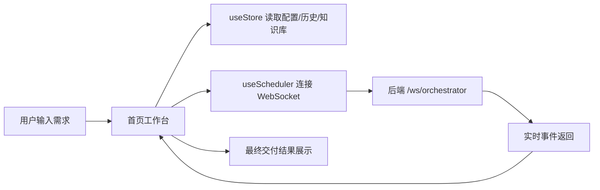

# MADO 前端说明文档

## 1. 前端到底做了什么

前端是一个面向前端研发任务的工作台，不负责真正的模型推理，而是负责把用户输入、知识库、Agent 配置、任务状态和最终交付结果组织成一个可操作的产品界面。

它主要做这几件事：

1. 接收用户需求、技术栈选择和上传文件。
2. 管理本地配置、任务历史和知识库文档。
3. 通过 WebSocket 连接后端编排任务。
4. 实时展示 Agent 执行过程、日志、工具审批和流式输出。
5. 展示最终生成代码、说明文档、路由说明和部署信息。

## 2. 前端技术栈

| 分类 | 技术 |
| --- | --- |
| 框架 | Next.js 16 |
| 视图层 | React 19 |
| 语言 | TypeScript 5 |
| 样式 | Tailwind CSS v4 |
| 组件 | Radix UI |
| 编辑器 | CodeMirror 6 |
| 图标 | lucide-react |
| 通信 | fetch + WebSocket |

前端页面基本都是 `use client`，核心逻辑都在客户端完成，没有看到 Next.js 服务端 API 作为主业务层。

## 3. 页面结构

| 路由 | 用途 |
| --- | --- |
| `/` | 首页任务工作台，输入需求并启动多 Agent 协同 |
| `/agent-manage` | Agent 开关、模型、超时等配置 |
| `/rag-knowledge` | RAG 知识库管理、切片、检索、问答 |
| `/history-task` | 历史任务列表、重跑、查看交付结果 |
| `/setting-help` | API 配置、参数配置、使用帮助 |

Navbar 负责全局导航、模型模式切换、API 配置入口和帮助入口。

## 4. 核心前端模块

### 4.1 状态与数据层

前端没有使用 Redux/Zustand 这类外部状态库，而是用自定义 hooks + React state 组织状态。

| 模块 | 职责 |
| --- | --- |
| `useAppConfig` | 读取/保存 API Key、模型模式、超时、Agent 配置 |
| `useKnowledgeBase` | 管理知识库文档，支持增删改查和本地备份 |
| `useHistory` | 管理任务历史，支持增删改查和本地备份 |
| `useScheduler` | 管理运行时任务状态、WebSocket 连接、工具审批 |

这些状态会优先从后端数据库读取，失败后回退到 `localStorage`，保证页面可用性。

### 4.2 首页工作台

首页是最核心的入口，用户在这里：

1. 输入需求。
2. 选择技术栈。
3. 上传本次任务的文件。
4. 启动多 Agent 任务。
5. 查看流式输出、日志、审批弹窗和最终交付结果。

首页还会做一个轻量的 RAG 预览：当需求输入达到一定长度时，前端先调用后端 `/api/rag/search` 看是否有相关知识库命中。

### 4.3 RAG 页面

RAG 页面负责知识库维护，不是“问答页”那么简单。它支持：

1. 上传文档。
2. 手动添加规范。
3. 编辑、删除、下载文档。
4. 重新切片。
5. 测试检索效果。
6. 直接问知识库。

前端的切片逻辑在 `src/lib/rag/slicing.ts`，会尽量按标题、代码块、接口定义等结构切，而不是纯长度切块。

### 4.4 历史任务页

历史页负责回看过去的任务：

1. 查看任务状态。
2. 查看执行时间和结果。
3. 复制或查看交付代码。
4. 一键重跑历史任务。

### 4.5 Agent 管理页

这个页面用于调流程，不是单纯的设置页：

1. 开启或关闭某个 Agent。
2. 修改每个 Agent 的超时时间。
3. 查看每个 Agent 的职责和模型定位。
4. 重置为默认流程。

### 4.6 设置与帮助页

这里主要是：

1. 配置 API Key。
2. 调整 temperature、maxTokens、timeout。
3. 查看使用教程和常见问题。

## 5. 前端业务流

### 5.1 启动任务时前端做了什么

1. 校验需求长度。
2. 检查 API Key 是否已配置。
3. 收集需求、技术栈、上传文件、Agent 开关、Pipeline 配置。
4. 创建本地任务记录。
5. 打开 WebSocket 并发送 `start` 消息。

### 5.2 WebSocket 消息如何驱动界面

后端会推这些事件回来：

| 事件 | 前端动作 |
| --- | --- |
| `task_started` | 标记任务启动 |
| `agent_start` | 更新 Agent 状态为运行中 |
| `agent_progress` | 更新进度条 |
| `agent_log` | 追加日志 |
| `stream` | 追加流式输出 |
| `tool_approval` | 弹出工具审批框 |
| `agent_complete` | 标记 Agent 完成 |
| `task_complete` | 写入最终结果 |
| `task_error` | 标记失败并清理连接 |

## 6. 前端的关键特点

1. 这是一个“AI 研发工作台”，不是普通聊天页。
2. 页面职责清楚：工作台、知识库、历史、Agent 配置、帮助。
3. 前端只负责编排交互和状态展示，不直接做模型调用。
4. 任务状态是多任务并发的，不是单一会话。
5. 结果展示是文件级的，不是把一大段文本扔给用户看。

